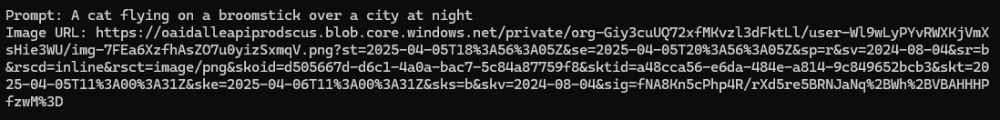

# 🎨 OpenAI Image Generation

## ✨ Features
- CLI app to generate images based on text prompts using OpenAI's DALL·E API
- Loads API key securely from `.env` file
- Simple prompt-based visual output generation
- Outputs image URL directly to console

---

## 🚀 Getting Started

1. 📄 Copy the `.env.example` file and rename it to `.env`.
2. 🛠️ Add your OpenAI API key:
    ```env
    OPENAI_API_KEY=sk-xxx...
    ```
3. ▶️ Run the app:
    ```bash
    dotnet run
    ```

> ❗ Make sure your `.env` file is set to **Copy if newer** in the file properties.

## 💬 Example Chat

## 💬 Example Chat

## 💬 Example Chat

## 💬 Example Chat

## 💬 Example Chat


<h3>🧹 A cat flying on a broomstick over a city at night</h3>
<p><b>Prompt:</b> A cat flying on a broomstick over a city at night</p>

<table>
<tr>
  <td><b>Terminal Output</b></td>
  <td><b>Generated Image</b></td>
</tr>
<tr>
  <td></td>
  <td></td>
</tr>
</table>
## 🔗 Resources

- [OpenAI API Docs](https://platform.openai.com/docs)
- [DotNetEnv GitHub](https://github.com/tonerdo/dotnet-env)
