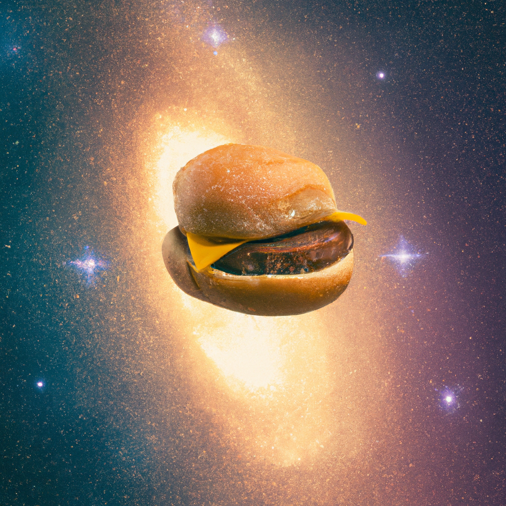
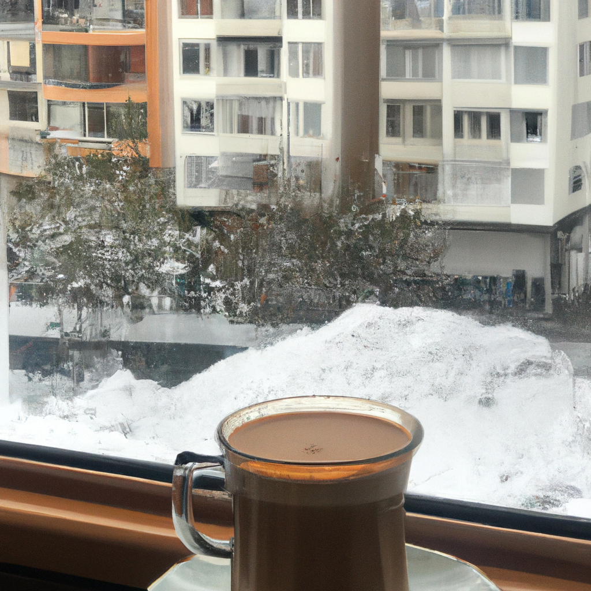

# 🎨 OpenAI Image Generation

## ✨ Features
- CLI app to generate images based on text prompts using OpenAI's DALL·E API
- Loads API key securely from `.env` file
- Simple prompt-based visual output generation
- Outputs image URL directly to console

---

## 🚀 Getting Started

1. 📄 Copy the `.env.example` file and rename it to `.env`.
2. 🛠️ Add your OpenAI API key:
    ```env
    OPENAI_API_KEY=sk-xxx...
    ```
3. ▶️ Run the app:
    ```bash
    dotnet run
    ```

> ❗ Make sure your `.env` file is set to **Copy if newer** in the file properties.

## 💬 Example Chat


## 💬 Example Chat


## 💬 Example Chat


## 💬 Example Chat


## 💬 Example Chat


