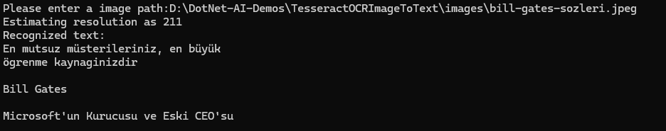
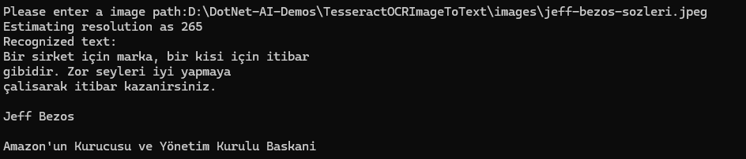

# TesseractOCRImageToText

🚀 **Lightweight CLI tool** to perform OCR on images using [Tesseract OCR](https://github.com/tesseract-ocr/tesseract) directly from .NET.

---

## ✨ Features

- 📦 Bundled `testdata` folder—no external installation required  
- 🔄 Windows x64 / x86 native DLLs included via NuGet  
- 🎯 Simple CLI interface: provide an image path, receive extracted text  
- 🌐 Multi-language support (English `eng`, Turkish `tur`)  

---

## 🛠️ Getting Started

### Prerequisites

- [.NET 6 SDK](https://dotnet.microsoft.com/download) or later  
- No additional system installs required on Windows  

### Installation

# Clone the repository
git clone https://github.com/Catujk/TesseractOCRImageToText.git
cd TesseractOCRImageToText

# Restore dependencies
dotnet restore

# Build the project
dotnet build

## 💬 Example Chat

## 💬 Example Chat

